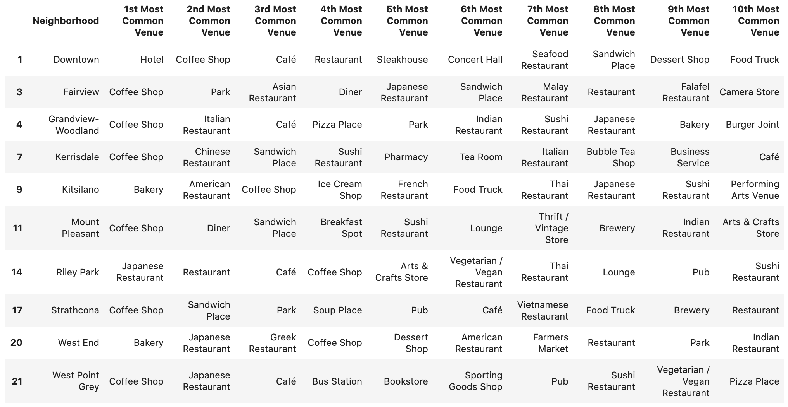

Qi Zhang
IBM Data Science Professional Certificate
August 15, 2020

# Analyzing Coffee Shop Locations in Vancouver, BC

Qi Zhang

IBM Data Science Professional Certificate

August 15, 2020

	Vancouer, Canada is considered one of the most livable cities in the world thanks to the weather. It is also the largest city in Western Canada, third largest metropolitan in Canada after Toronto and Montreal. People in Vancouver love coffee, and they even have lots of local coffee franchises including Waves Coffee and Blenz Coffee, but the demand for good coffee shops is never fulfilled. We are looking for a location for our new coffee shop, preferably at a neighborhood with less competitors. We will analyze and cluster the data to find out the best location for our new business.

### Data for Analyzation

__Data of this project includes the following:__

1. Neighborhood names of City of Vancouver
2. Geopy library to find the latitude and longitude of each neighborhood
3. Foursquare location data to find venues in each neighborhood

### Data Gathering and Cleaning

Vancouver neighborhood names are fetched from the City of Vancouver government website.  By using beautifulsoup library, the list of Vancouver neighborhood names is downloaded. The list is then transformed into a pandas dataframe.

By using geopy library, the analysis is able to request coordinate data for each neighborhood. As a result,  latitude and longitude values are attached to each neighborhood.
By using a foursquare library, we can request the closest 100 venues within 500 meters of each neighborhood coordinate. Then the data is transformed into different tables to perform analysis.

### Exploratory Data Analysis

Total number of venues is explored for each neighborhood. As we can see from the table below, some of the neighborhoods have less than 15 venues. These neighborhoods are mostly residential or industrial areas where there is few commercial real estate available.

To make our clustering effective, neighborhoods with less than or equal to 15 venues are removed from our analysis.

For the rest neighborhoods, since the venue data comes with the store category, we transform the data to frequency analysis. We can see the frequency of different venue categories for each neighborhood. Based on this table, we can finally derive our table with neighborhoods, coordinate data, and top ten categories of each neighborhood.

K-mean clustering is applied to the data. We set the number of clusters equal to 3, because the City of Vancouver is a relatively small city with roughly 600 thousand population (City of Vancouver). 

We can plot the resulting clusters in a map.

Neighborhoods are divided into 3 clusters.

The above table is the first cluster, showing red in the map. Neighborhoods in this cluster are mostly traditional Canadian neighborhoods where coffee shops, cafes, and bakeries are popular.

The above table is the second cluster, showing bluish green in the map. Coffee shops in this area are extremely popular, and 28% of the venues in this area are coffee shops.

The above table is the third cluster, showing purple in the map. We can see from the table that Asian food restaurants are extremely popular in this area. 

### Discussion

There is a strong competition in the second cluster about coffee shops. Although South Cambie only has 18 venues, 5 of them are coffee shops. What's more, the "shopping mall" venue in this area indicates the Oakridge Shopping Center, one of the largest shopping malls in the city. It is not easy to start a new business in this market.

The last cluster includes international neighborhoods. It is possible that a large number of residents are from Asia, where coffee is not as popular as here in North America. Although there are not many competitors, the demand is relatively low in these neighborhoods.

The first cluster is the cluster we should look at. This cluster consists of many traditional Canadian neighborhoods, where coffee is popular among residents. However, Kitsilano, Riley Park, and West End are neighborhoods with not enough coffee shops, and that means these neighborhoods have demand for coffee and less competitors.

Three neighborhoods have similar amounts of venues, which are comparable. From the map, we see West End and Kitsilano are on each side of English Bay. These areas are more interesting which attracts many tourists.

As a result, we recommend opening new business in the West End or Kitsilano. The two neighborhoods are traditional Canadian neighborhoods which have high demand for coffee  with relatively less competitors. What’s more, since the two neighborhoods are by the sea, there is a higher chance that we could rent a commercial store with a beautiful view, which eventually will attract tourists.

### Works Cited
“Population.” City of Vancouver, 2016, vancouver.ca/news-calendar/population.aspx.

